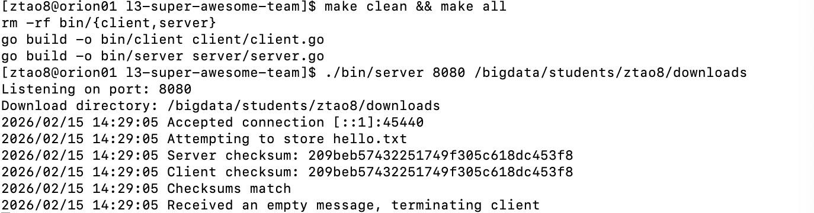
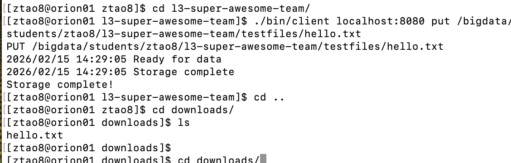
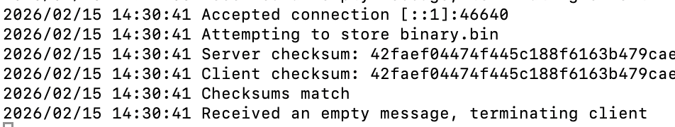
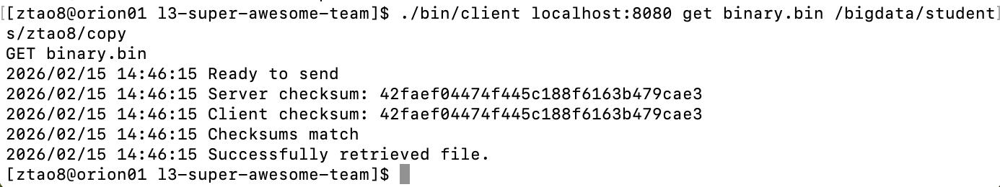

# file-transfer
## Changes of Server:
1. To ensure there is enough space available on the disk: I check available disk memory for the given directory before server sends OK response.
2. During streaming process, I check whether there's a failure/error.
3. Check if there's error for receiving checksum.
4. Respond to the client with the status of the transfer (success or failure), rather than only track logs. Also, disconnect the client
5. In retrieving process, server will indicate failure if the file doesn’t exit
## Changes of Client:
1. Send only the base file name (not the full path) to the server during PUT, since the system does not support directories.
2. Handle the error from opening the file during PUT instead of silently ignoring it.
3. Support the optional `[destination-dir]` argument for GET by saving the retrieved file into the specified directory (defaults to current working directory).
4. Return a non-zero exit code when GET checksum verification fails, instead of always returning success.
5. Clean up the created file if the server rejects the retrieval request.
## Test

